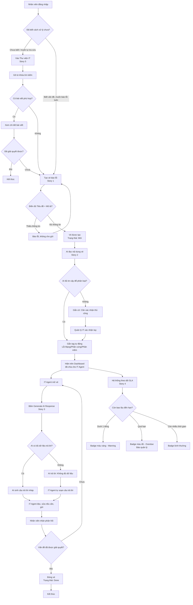

Luồng đi: **Login → Tạo vé → AI phân loại → AI phản hồi/SLA → Đóng vé**, có nhánh lỗi/rẽ nhánh và nhánh Knowledge Base (tự phục vụ trước khi tạo vé).

---

### Happy path (đường chính)
Đăng nhập → Tạo vé → AI tự phân loại → Hiện trên Dashboard IT → IT Agent dùng AI gợi ý trả lời → Nhân viên nhận phản hồi → Đóng vé.

### Nhánh rẽ 1: Tự phục vụ trước (Knowledge Base — Story 5)
Nhân viên có thể tra cứu Thư viện IT trước khi tạo vé. Nếu tìm thấy bài viết và tự giải quyết được → kết thúc sớm, không cần tạo vé, giảm tải cho IT.

### Nhánh lỗi 1: Thiếu thông tin khi tạo vé (Story 1)
Nếu nhân viên bỏ trống Tiêu đề/Mô tả → hệ thống chặn lại, yêu cầu điền lại.

### Nhánh lỗi 2: AI không chắc chắn khi phân loại (Story 2)
Nếu AI thiếu tin cậy → không tự động gán, chuyển cho Quản lý IT xác nhận thủ công, tránh phân loại sai.

### Nhánh lỗi 3: AI không đủ dữ liệu để trả lời (Story 3)
AI không bịa câu trả lời — báo rõ "Không đủ dữ liệu", IT Agent tự soạn.

### Nhánh song song: Giám sát SLA (Story 4)
Chạy song song với toàn bộ luồng xử lý vé, liên tục kiểm tra thời gian còn lại để cảnh báo đúng lúc.

### Vòng lặp: Chưa giải quyết xong
Nếu nhân viên nhận phản hồi nhưng vấn đề chưa hết → quay lại cho IT Agent xử lý tiếp, chưa đóng vé.

---

