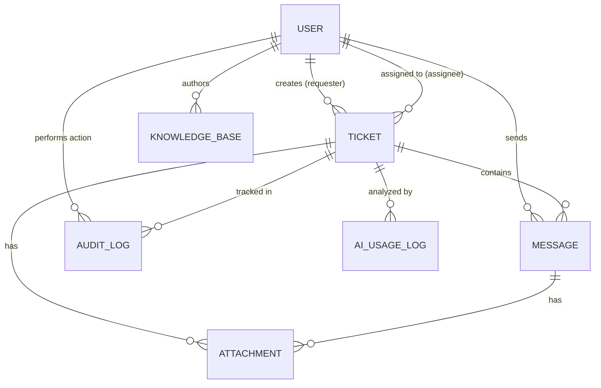

# Mô hình Dữ liệu (Data Model)

Tài liệu này định nghĩa cấu trúc dữ liệu chính (Entities) của hệ thống AI Helpdesk cùng các quy tắc ràng buộc (Rules).

## Bảng Data Model

| Entity | Fields chính | Rules |
| :--- | :--- | :--- |
| **User** | `id, email, name, role, created_at` | `role` ∈ `USER` \| `AGENT` \| `MANAGER` |
| **Ticket** | `id, requester_id, assignee_id, title, description, status, priority, category, sla_due_at, created_at` | `status` ∈ `NEW` \| `IN_PROGRESS` \| `DONE` `priority` ∈ `LOW` \| `MEDIUM` \| `HIGH` \| `CRITICAL` |
| **Message** | `id, ticket_id, sender_id, content, is_internal, created_at` | `is_internal` = true (chỉ nội bộ Agent thấy) hoặc false (khách hàng thấy) |
| **Attachment** | `id, entity_type, entity_id, file_url, created_at` | `entity_type` ∈ `TICKET` \| `MESSAGE` |
| **KnowledgeBase** | `id, title, content, category, author_id, updated_at` | `content` không được rỗng |
| **AIUsageLog** | `id, ticket_id, action, prompt_summary, response_summary, latency, created_at` | Redact các thông tin nhạy cảm; KHÔNG lưu trữ API Key |
| **AuditLog** | `id, actor_id, action, target_type, target_id, changes, created_at` | Append-only (chỉ ghi thêm, không sửa/xóa); dùng để track lịch sử đổi trạng thái Ticket, gán việc |

## Sơ đồ Thực thể Liên kết (ERD)

