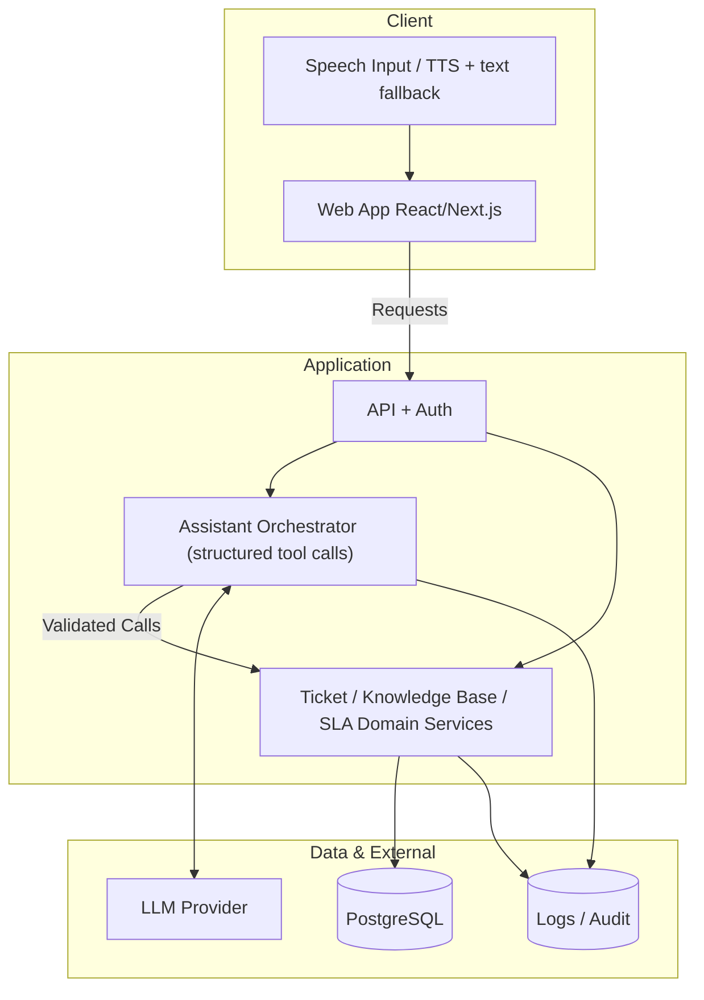

# Sơ đồ Kiến trúc Tổng thể

## Các nguyên tắc thiết kế quan trọng

- **LLM không truy cập DB trực tiếp**: LLM chỉ nhận ngữ cảnh từ người dùng/hệ thống và đề xuất các hành động thông qua `structured tool call` (Ví dụ: `assign_category`, `draft_agent_reply`).
- **Validation chặt chẽ**: Tầng Application sẽ trực tiếp validate (kiểm tra tính hợp lệ) tên tool, quyền người dùng (role), các tham số (arguments) và quy tắc nghiệp vụ (business rules) trước khi thực sự gọi các domain service.
- **Source of Truth**: Ticket/Knowledge Base/SLA Domain service luôn là nguồn sự thật (source-of-truth) duy nhất cho toàn bộ dữ liệu nghiệp vụ. AI chỉ là công cụ hỗ trợ đề xuất.
- **Audit & Logging**: Audit log có nhiệm vụ lưu lại các tool call metadata, kết quả, latency, các sự kiện tạo/thay đổi trạng thái vé (đáp ứng NFR-HD-04); hệ thống tuyệt đối không lưu secret, raw audio hay API keys vào log.
